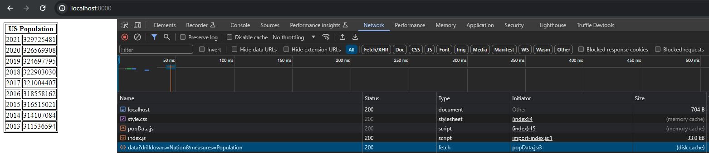

# CS3980-HW2
This is the README file for the second assignment in CS:3980 for the Spring 2024 semester.

## How to Run
First, create a virtual environment with
`python -m venv venv`,
and open it with
`.\venv\Scripts\activate`.

Then install the necessary packages with
`pip install -r requirements.txt`.

Finally, start the program with
`uvicorn api:app --port 8000 --reload`.

Then just open localhost:8000 and you should see the webpage.

## api.py
This is the Python code that runs the website. It uses FastAPI for the app and Starlette for the file responses.

## index.html
This is the HTML fromt end for the webpage. It consists of a table containing data on the population of the United States over the past years. The table is populated by popData.js and stylized by style.css.

## popData.js
This is the JavaScript code used to populate the data in the table. It fetches the data from Data USA using the API endpoint:
> https://datausa.io/api/data?drilldowns=Nation&measures=Population

## style.css
This is the style sheet for the HTML file. It adds borders to the table.